# teaclave-storm

Everything you need to prototype a secure Apache Storm topology with confidential computing, powered by Apache Teaclave SGX enclaves. This repository adapts the [`apache-storm-starter`](https://github.com/lucadibello/apache-storm-starter/) word-count example so every sensitive operation runs inside Intel SGX enclaves while the host topology stays unchanged.

## Example topology

- `RandomJokeSpout` (2 executors) reads the bundled `jokes.json` dataset and emits random jokes (id, category, rating, body).
- `SplitSentenceBolt` (3 executors) tokenizes each joke body into lowercase words **inside an SGX enclave**.
- `WordCounterBolt` (3 executors) maintains per-word counters **inside an SGX enclave** and emits the running total.
- `HistogramBolt` (single executor) collects the counts into a global histogram **inside an SGX enclave** and writes a timestamped snapshot to `data/histogram.txt` every 5 seconds.

`WordCountTopology` wires these components with shuffle and fields groupings. Each bolt that processes sensitive data inherits from `ConfidentialBolt` and delegates computation to a Teaclave service that executes inside hardware-protected memory. Production mode can be toggled via the `STORM_PROD` environment variable or the `-Dstorm.prod` system property (both default to `false`).

## Topology diagram



The double arrows show each bolt invoking its dedicated Teaclave service running inside an SGX enclave before emitting downstream tuples.

Dataset source: <https://github.com/taivop/joke-dataset/blob/master/stupidstuff.json>

## Run it locally

1. Build the multi-module Maven project (this compiles the host, common APIs, and enclave images):

   ```bash
   cd confidentialstorm
   mvn clean package
   ```

2. Launch the word-count topology with the Storm CLI (requires the topology jar produced in step 1):

   ```bash
   cd confidentialstorm
   sudo storm local --local-ttl 120 host/target/confidentialstorm-topology.jar \
     ch.usi.inf.confidentialstorm.WordCountTopology \
     -- --local
   ```

   The `Makefile` exposes the same command as `make run-local`, which handles the path and `--local-ttl` defaults for you.

3. Watch the console logs; each bolt uses SLF4J to report the tuples it processes, and enclave calls are tagged with `[ENCLAVE]`.

4. While the topology is running (or right after it stops), open `data/histogram.txt` to inspect the aggregated word frequencies.

Tip: remove `data/histogram.txt` between runs if you prefer a clean snapshot.

## Devcontainer tasks

> [!IMPORTANT]  
> These commands rely on the [go-task](https://taskfile.dev/) runner. Install it locally (`brew install go-task`, `scoop install task`, or download a binary) or run the commands from inside the devcontainer where it is already available.

- `task devcontainer`: build, start, and attach to the devcontainer (runs build → up → attach). The container ships with the SGX SDK, Teaclave runtime, and Storm CLI preconfigured.
- `task devcontainer-recreate`: tear down the existing container and rebuild from scratch.
- `task devcontainer-build`: build the devcontainer image only.
- `task devcontainer-up`: start (or reuse) the container.
- `task devcontainer-attach`: exec into the container and attach to the tmux session.
- `task devcontainer-down`: stop and remove the container plus its volumes.

## Submit to a remote Storm cluster

1. Build the shaded topology jar:

   ```bash
   cd confidentialstorm
   mvn clean package -pl host -am
   ```

   The artifact lands in `confidentialstorm/host/target/confidentialstorm-topology.jar` and already bundles the enclave artifacts produced by the `enclave` module.

2. Toggle production mode at runtime by exporting `STORM_PROD=true` or passing `-Dstorm.prod=true` (no code changes required).

3. If you are using the devcontainer, enter it with `task devcontainer` or `task devcontainer-attach`; it provides a Storm CLI configured via `conf/storm.yaml`.

4. Submit the topology (remember to enable production mode, e.g. with `STORM_PROD=true`):

   ```bash
   STORM_PROD=true storm jar confidentialstorm/host/target/confidentialstorm-topology.jar \
     ch.usi.inf.confidentialstorm.WordCountTopology \
     ConfidentialWordCountTopology
   ```

   Replace the last argument if you want a different topology name.

5. Monitor the deployment through the Storm UI (`http://<nimbus-host>:8080`) or via `storm list`, and stop it when you're done:

   ```bash
   storm kill ConfidentialWordCountTopology
   ```

If you need to submit from outside the devcontainer, copy `confidentialstorm/host/target/confidentialstorm-topology.jar` and `conf/storm.yaml` to the target machine, then update the endpoints in `storm.yaml` to match the remote cluster.

### Local test cluster (docker-compose)

- The repo ships with `docker-compose.yml`, which launches ZooKeeper, Nimbus, a Storm UI, and a Supervisor wired to the same configuration as `conf/storm.yaml`.
- Start the stack with `docker compose up -d` (or `docker-compose up -d`) before running `storm jar` to test remote submissions against your local cluster.
- The devcontainer already connects to the external `storm-net` bridge declared in the compose file, so any `storm` commands you run inside it automatically reach the services exposed by the stack.

## Project structure

```
confidentialstorm/
├── common/          # Shared interfaces and models
│   ├── api/         # Service interfaces (SplitSentenceService, WordCountService, HistogramService)
│   └── model/       # Request/response DTOs
├── enclave/         # SGX enclave implementations
│   ├── split/       # SplitSentenceServiceImpl (Teaclave service)
│   ├── wordcount/   # WordCountServiceImpl
│   └── histogram/   # HistogramServiceImpl
└── host/            # Storm topology components
    ├── bolts/       # SplitSentenceBolt, WordCounterBolt, HistogramBolt
    │   └── base/    # ConfidentialBolt abstraction used by enclave-aware bolts
    └── spouts/      # RandomJokeSpout
```

## Prerequisites

- OpenJDK 17 and Maven 3.9+ (the enclave build relies on Java 17 features and recent Maven plugins).
- [Apache Teaclave Java TEE SDK 0.1.0](https://teaclave.apache.org/) with the SGX platform plugins configured; the devcontainer uses the `teaclave/teaclave-java-tee-sdk:v0.1.0-ubuntu18.04` base image.
- GraalVM CE 22.2.0 (Java 17) with `native-image` plus a standard C/C++ toolchain (`gcc`, `g++`, `cmake`, `make`, `zlib1g-dev`, etc.) to build the enclave shared libraries.
- Intel SGX-capable hardware with the PSW/driver installed, or SGX simulation mode; set `org.apache.teaclave.javasdk.platform` accordingly.
- Apache Storm CLI 2.8.x available on the host machine. The local workflow uses `sudo storm local`, so your user must have sudo rights (or an equivalent capability-based setup).
- Docker Engine + Docker Compose if you plan to run the optional `docker-compose.yml` cluster or the VS Code devcontainer (the compose stack expects an external `storm-net` bridge).
- Optional: `devcontainer` CLI / VS Code Dev Containers and [go-task](https://taskfile.dev) to run the helper tasks.

## Security notes

- All text processing (splitting, counting, histogram aggregation) happens inside SGX enclaves, protecting data from both the host OS and other processes.
- The `ConfidentialBolt` base class provides a common pattern for Storm bolts that delegate to Teaclave services over secure channels.
- Enclave attestation and secure channel establishment are handled by the Teaclave Java SDK; verify attestation evidence and provision production keys before deploying to untrusted environments.
